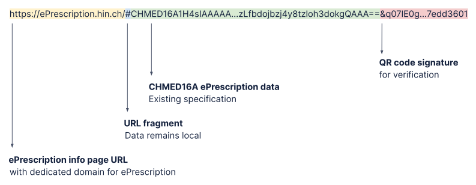
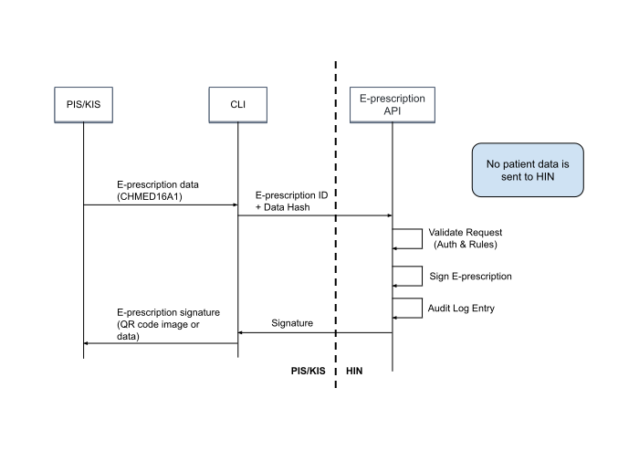
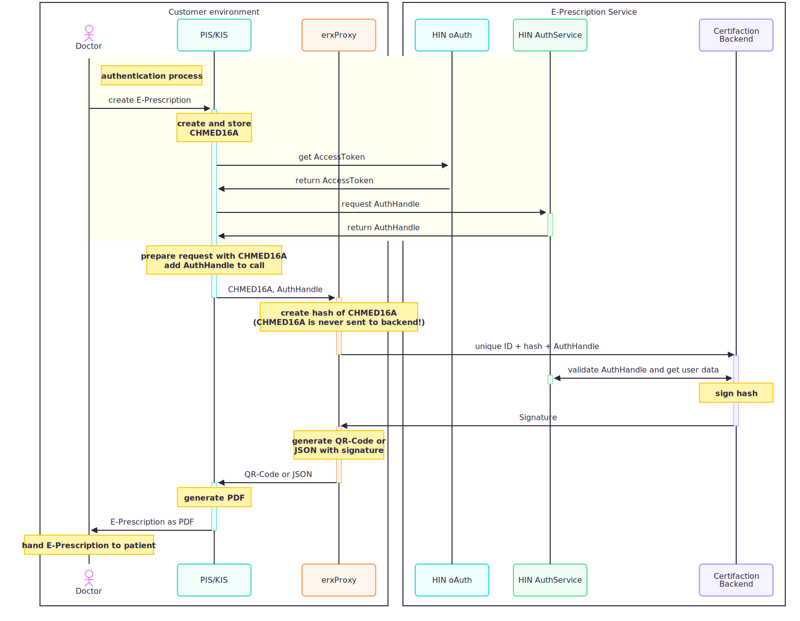

# Integration guide: E-Prescription Switzerland service

## 1. E-Prescription Switzerland service

**The secure digital E-Prescription for the Swiss healthcare sector**

The E-Prescription Switzerland service enables doctors to issue digital prescriptions – easily and in accordance with the law. The QR code enables pharmacies to record and validate them automatically. This means that processes in doctor's practices and pharmacies are more secure and more efficient. The E-Prescription Switzerland service is a functionality of HIN Sign. The use of this service is linked to HIN membership.


**Use cases**

The E-Prescription Switzerland service includes the following use cases for doctors and pharmacists:

* Signing E-Prescriptions
* Verifying E-Prescriptions
* Revoking E-Prescriptions
* (Partial) dispensing of E-Prescriptions
* (Temporary) locking of E-Prescriptions
* Cancelling these actions

### 1.2. Integration of the E-Prescription Switzerland service

**E-Prescription versus HIN Sign**

The integration of the E-Prescription Switzerland service may seem similar to the integration of the HIN Sign service.
However, there are important differences to be aware of:
The HIN Sign document signature can be used to sign documents, which don't require a handwritten signature by law. Examples:

* Certificates of incapacity for work
* Reports and expert opinions
* Clinical findings
* Forms

* Medical prescriptions may not be signed with HIN Sign.

## 2. E-Prescription Switzerland service: QR code specification

The E-Prescription Switzerland service QR code contains the E-Prescription data in machine-readable form, as well as an electronic signature.

The QR Code contains:

1. A link to the E-Prescription information page
2. The E-Prescription data in CHMED16A1 format
3. The signature data for verification



The use of a “URL fragment” in the link ensures that the E-Prescription data is only available locally and is not sent to a server.


### 2.1. E-Prescription data in the QR code

Applications that want to verify the E-Prescription can do so by using the link in the QR code as the input for the [verify command](#422-verifying-an-E-Prescription-qr-code). Example:
```
https://eprescription.hin.ch/#CHMED16A1...AA==&q07lE0g4asrIIR9mdBgSIHUVsf9k9QIF+74331de34a747ea1a786dc369be50ac7bf222dde9788d8a170df8b6f593f1e8306eea7a79bcbfe9ae843308b1f860653886de77629cf1ae040537bfe817edd3601&i=FirstName%20Surname%20%28HIN%20Id%29&t=1637579060&s=74331de34a747ea1a786dc369be50ac7bf222dde9788d8a170df8b6f593f1e8306eea7a79bcbfe9ae843308b1f860653886de77629cf1ae040537bfe817edd3601
```

The E-Prescription data is located in the link in the QR code between the "#" and the "&". It is based on the <a href="https://drive.google.com/file/d/1Suyfb4I5WuII-XBqGuHLPocUIQ5mkTjA/view" target="_blank">CHMED16A specification</a>. Because the link should be as short as possible, only the compressed variant CHMED16A1 should be used.

### 2.2. QR code signature

The QR code signature ensures the integrity and authenticity of the E-Prescription and enables it to be verified. A key pair is used to save space. The signature is about 250 to 300 characters in length.

The signature contains:

* Identity of the signee (Name and ID)
* Timestamp
* Cryptographic signature

Example:
```
&i=Firstname%Lastname%20%28ID%29&t=1637579060&s=74331de34a747ea1a786dc369be50ac7bf222dde9788d8a170df8b6f593f1e8306eea7a79bcbfe9ae843308b1f860653886de77629cf1ae040537bfe817edd3601
```

### 2.3. Audit log

Every action triggers an entry in a HIN E-Prescription audit log. It contains the following information:

* Type of action
* Action data
	* E-Prescription ID
	* Any other action parameters
* Actor (user identity)
* Timestamp of action

The audit log ensures a transparent use of the service. The audit log may also be used to identify and correct any misuse.
The audit log does not contain any patient data.

### 2.4. Rules

| Action   | Rules                                                                                                                                                                                                                                                                                                      |
|:---------|:-----------------------------------------------------------------------------------------------------------------------------------------------------------------------------------------------------------------------------------------------------------------------------------------------------------|
| Create   | - CHMED16A E-Prescription ID must be a randomly generated ID, according to the UUID standard<br>- CHMED16A E-Prescription ID must be unique and not issued yet                                                                                                                                             |
| Revoke   | - CHMED16A E-Prescription ID must exist<br>- Revocation is final. Revoked E-Prescriptions can only be verified.                                                                                                                                                                                            |
| Dispense | - CHMED16A E-Prescription ID must exist<br>- CHMED16A E-Prescription ID must not have been revoked<br>- If the CHMED16A E-Prescription ID was fully dispensed, further dispensations must be forced (see [4.2.4. Recording an E-Prescription Dispensation](#424-recording-an-E-Prescription-dispensation)) |
| Verify   | n/a                                                                                                                                                                                                                                                                                                        |
| Cancel   | The event to be cancelled must:<br>- exist<br>- have been created by the same HIN eID<br>- not have been cancelled already                                                                                                                                                                                 |
| Lock     | CHMED16A E-Prescription must exist and must not be locked or revoked.                                                                                                                                                                                                                              |
| Unlock   | CHMED16A E-Prescription must exist, must be locked and must not be revoked.                                                                                                                                                                                                                                        |


### 2.5. Events

Events record the lifecycle of an E-Prescription. 

#### 2.5.1. Event types

<table>
  <tr>
   <td>Revoke
   </td>
   <td>The E-Prescription is marked as void and is not valid anymore. This has nothing to do with dispensations and should only be used for wrongly issued E-Prescriptions.
   </td>
  </tr>
  <tr>
   <td>Partial dispense
   </td>
   <td>One or multiple prescribed medicaments are dispensed. The E-Prescription still contains medicaments that were not dispensed. Partial dispenses of revoked E-Prescriptions are not allowed. Partial dispenses of fully dispensed E-Prescriptions must be forced (see <a href="https://github.com/certifaction/hinsign-cli#424-recording-an-E-Prescription-dispensation">4.2.4. Recording an E-Prescription Dispensation</a>). In the case of forced dispensations, the responsibility lies with the dispensers (pharmacists).
   </td>
  </tr>
  <tr>
   <td>Full dispense
   </td>
   <td>The E-Prescription or all medicaments contained in it are  dispensed. If all medicaments contained in the E-Prescription have been dispensed through partial dispense, a full dispense must be made afterwards (this is not done automatically). Dispenses of revoked E-Prescriptions are not allowed. Full dispenses of fully dispensed E-Prescriptions must be forced (see <a href="https://github.com/certifaction/hinsign-cli#424-recording-an-E-Prescription-dispensation">4.2.4. Recording an E-Prescription Dispensation</a>). In the case of forced dispensations, the responsibility lies with the dispensers (pharmacists).
   </td>
  </tr>
  <tr>
   <td>Cancel
   </td>
   <td>An event (Revoke, Partial dispense, Full dispense, Cancel) is cancelled.
   </td>
  </tr>
  <tr>
    <td>Lock</td>
    <td>The E-Prescription is locked. The lock reason is included in the lock event, if a reason was provided.</td>
  </tr>
  <tr>
    <td>Unlock</td>
    <td>The E-Prescription is unlocked. The unlock reason is included in the unlock event, if a reason was provided.</td>
  </tr>
</table>

#### 2.5.2. Event data

Events contain the following data:

<table>
  <tr>
   <td><strong>Field name</strong>
   </td>
   <td><strong>Mandatory?</strong>
   </td>
   <td><strong>Description</strong>
   </td>
  </tr>
  <tr>
   <td>Id
   </td>
   <td>mandatory
   </td>
   <td>Internal Id of an event
   </td>
  </tr>
  <tr>
   <td>Type
   </td>
   <td>mandatory
   </td>
   <td>Event type
<p>
The following event types exist:<p>
<p>
<code>revoke | partial_dispense | full_dispense | cancel | lock | unlock</code><p>
   </td>
  </tr>
  <tr>
   <td>Reference
   </td>
   <td>mandatory
   </td>
   <td>Reference to the "Id" field of the CHMED16A E-Prescription
   </td>
  </tr>

  <tr>
   <td>Dispenses
   </td>
   <td>optional
   </td>
   <td>For <code>partial_dispense</code>:
<p>
A list of medicament dispenses with the following fields:
</p>
<table>
  <tr>
   <td><strong>Parameter</strong>
   </td>
   <td><strong>Value</strong>
   </td>
   <td><strong>Description</strong>
   </td>
  </tr>
  <tr>
   <td>Id
   </td>
   <td>string
   </td>
   <td>The Id of the medicament*
   </td>
  </tr>
  <tr>
   <td>Amount
   </td>
   <td>int
   </td>
   <td>Amount dispensed
   </td>
  </tr>
  <tr>
   <td>Substitute
   </td>
   <td>string
   </td>
   <td>The Id of the substitute  / medicament*
   </td>
  </tr>
  <tr>
   <td>Substitute Id Type
   </td>
   <td>string
   </td>
   <td>The Id type of the substitute  / medicament
   </td>
  </tr>
</table><p>
*The Id is the field “Id” from the list of “Medicaments” from the CHMED16A data received as input. It does not regard the IdTypes and therefore works with all of them, assuming no collision between the different Types.</p>
   </td>
  </tr>

<tr>
   <td>Event data
   </td>
   <td>optional
   </td>
   <td>
<p>For <code>cancel</code>:
<br>A reference to an Id of another event.</p>
<table>
  <tr>
   <td><strong>Parameter</strong>
   </td>
   <td><strong>Value</strong>
   </td>
   <td><strong>Description</strong>
   </td>
  </tr>
  <tr>
   <td>EventId
   </td>
   <td>string
   </td>
   <td>The Id of the event
   </td>
  </tr>
</table>
   </td>
  </tr>

  <tr>
   <td>Timestamp
   </td>
   <td>mandatory
   </td>
   <td>Timestamp of the event
   </td>
  </tr>
  <tr>
   <td>Actor HIN eID
   </td>
   <td>mandatory
   </td>
   <td>The actor's HIN eID
   </td>
  </tr>
  <tr>
   <td>Actor name
   </td>
   <td>mandatory
   </td>
   <td>The actor's name
   </td>
  </tr>
</table>

The event data is hosted in anonymised form (without the content of the E-Prescription and without patient information) by HIN in Switzerland.

## 3. Integration of the E-Prescription Switzerland service

### 3.1 Architecture

Issuing systems (PIS/KIS) integrate the E-Prescription Switzerland service via the CLI, as shown in the diagram below. Patient and E-Prescription data remains local and is never sent to HIN.



<!---
**Authentication**<br>
The issuance of E-Prescriptions requires authentication on near EPD level. This authentication is done via the HIN Authentication Service, which ensures that the user was correctly identified as a doctor and recently authenticated.


--->
## 4. E-Prescription API

### 4.1. Introduction

#### 4.1.1. Launch of the erxproxy

To launch the erxproxy, execute the following command:
```
./erxproxy server
```

#### 4.1.2. E-Prescription JSON input
The Certifaction CLI command generates E-Prescriptions signatures for E-Prescriptions based on the CHMED16A1 standard as described under [QR code specification](#2-E-Prescription-switzerland-service-qr-code-specification).

#### 4.1.3. General usage

Please refer to [E-Prescription endpoints](#42-E-Prescription-endpoints) for the list of all available endpoints.

#### 4.1.4. Authentication

Please see [Authentication method for signing an e-prescription](https://developers.e-rezept.ch/erezept/en/authen.html) for doctor authentication and [Authentication method for (partial) redemption of an e-prescription](https://developers.e-rezept.ch/erezept/en/disauthen.html) for pharmacy authentication.<br>

When indicated, the requests must be authenticated as following (an environment is provided for testing that does not enforce authentication):

HTTP Server Mode (oAuth via HIN ACS for dispenses):
```
Authorization: Bearer acs:<token>
```

HTTP Server Mode (Auth-Service for the signing process):
```
Authorization: Bearer oauth:<token>
```

If the request is not authenticated a HTTP 401 Unauthorized or a HTTP 403 Forbidden response is returned.

### 4.2. E-Prescription Endpoints

This section describes the additional endpoints available when the E-Prescription mode is enabled.

When the E-Prescription mode is enabled, the following new endpoints are enabled:

<table>
  <tr>
   <td>POST /ePrescription/create
   </td>
   <td>Return a signed E-Prescription QR code from the valid JSON document provided in the body.
   </td>
  </tr>
  <tr>
   <td>POST /ePrescription/verify
   </td>
   <td>Return verification information about a signed E-Prescription QR code provided in the body.
   </td>
  </tr>
  <tr>
   <td>POST /ePrescription/revoke/&lt;id>
   </td>
   <td>Invalidate a signed E-Prescription QR code by registering it as revoked.
   </td>
  </tr>
  <tr>
   <td>POST /ePrescription/lock/&lt;id>
   </td>
   <td>Lock the E-Prescription to prevent any action on it. It must be unlocked before any other action can be done
   </td>
  </tr>
  <tr>
   <td>POST /ePrescription/unlock/&lt;id>
   </td>
   <td>Unlock a locked E-Prescription.
   </td>
  </tr>
  <tr>
   <td>POST /ePrescription/dispense/&lt;id>
   </td>
   <td>Registers a full or partial dispensation for a signed E-Prescription.
   </td>
  </tr>
  <tr>
   <td>POST /ePrescription/cancel/&lt;id>/event/&lt;eventid>
   </td>
   <td>Registers a cancelation of an event (revoke, dispense, cancel).
   </td>
  </tr>
</table>

The HTTP endpoints directly mirror the CLI commands.

#### 4.2.1. Creating an E-Prescription QR Code

**Usage**
```
POST /ePrescription/create
```

**Description**<br>
Generate a signed E-Prescription QR code from a valid input JSON document in the body.  The available output formats are the following:

* a QR Code image binary data in PNG format, or
* the signed QR Code data as json string

**Authenticated**<br>
Yes

**Query parameters**

<table>
  <tr>
   <td><strong>Parameter</strong>
   </td>
   <td><strong>Value</strong>
   </td>
   <td><strong>Default</strong>
   </td>
   <td><strong>Description</strong>
   </td>
  </tr>
  <tr valign="top">
   <td>output-format
   </td>
   <td>data or qrcode
   </td>
   <td>qrcode
   </td>
   <td>Sets the output format:
<ul>
<li>qrcode: returns the signed QR Code as a PNG
<li>data: returns the signed qr code data as string in JSON
</li>
</ul>
   </td>
  </tr>
  <tr valign="top">
   <td>size
   </td>
   <td>Value in pixels
   </td>
   <td>
   </td>
   <td>Can be used with the --output-format qrcode to indicate the size of the resulting QR Code in pixels (optional)
   </td>
  </tr>
</table>


**Response**

<table>
  <tr>
   <td>200 OK
   </td>
   <td>Returns the requested signed QR code in the required format
   </td>
  </tr>
  <tr>
   <td>400 Bad Request
   </td>
   <td>Failed to parse QR code size
   </td>
  </tr>
  <tr>
   <td>409 Conflict
   </td>
   <td> Prescription already exists
   </td>
  </tr>
</table>

Depending on the value of the output-format query parameter:

<table>
  <tr>
   <td><strong>MIME type</strong>
   </td>
   <td><strong>Content</strong>
   </td>
  </tr>
  <tr>
   <td>image/png
   </td>
   <td>The signed E-Prescription QR Code image as a PNG
   </td>
  </tr>
  <tr>
   <td>application/json
   </td>
   <td>The signed QR code data as string in JSON
   </td>
  </tr>
</table>

#### 4.2.2. Verifying an E-Prescription QR Code

**Usage**
```
POST /ePrescription/verify
```

**Description**<br>
Returns verification information about a signed E-Prescription QR code provided in the body.

**Authenticated**<br>
No (see below for exceptions)

**Request Body**<br>
A signed E-Prescription QR Code in its string form.

**Response**<br>
The verification information consists of the following information:

| Field           | Description                                                                                                     |
|-----------------|-----------------------------------------------------------------------------------------------------------------|
| Prescription ID | The unique ID for E-Prescription. This is the ID you use to revoke the E-Prescription.                          |
| Issued At       | The date and time at which the E-Prescription was issued.                                                       |
| Issued By       | The name of the E-Prescription's issuer.                                                                        |
| Valid           | True if the E-Prescription is correctly signed and not tampered with                                            |
| Revoked         | True if the E-Prescription has been marked as revoked                                                           |
| Dispensed       | True if the E-Prescription has been marked as fully dispensed                                                   |
| Dispensed At    | The date and time at which the E-Prescription was dispensed.                                                    |
| Dispensations   | If available, an array containing each Medicament with a recorded Dispensation event and a list of those events |
| Locked          | True if the E-Prescription is currently locked.                                                                 |
| Locked at       | The time at which the E-Prescription was locked.                                                                |
| Lock reason     | The reason for the E-Prescription lock. This is available to authenticated actors only.                         |
| Unlock reason   | The reason for unlocking the E-Prescription. This is available to authenticated actors only.                    |
| Events          | A list of all events that have been recorded for the E-Prescription, from the earliest to the most recent.      |

**Example Response**

```json
{
   "prescription_id":"00000000-0000-0000-0000-000000000000",
   "issued_at":"0000-00-00T00:00:00+00:00",
   "issued_by":"Dr. Test Test 1 (test1)",
   "valid":true,
   "revoked":false,
   "dispensed":true,
   "dispensed_at":"0000-00-00T00:00:00.000000000Z",
   "locked": false,
   "events":[
      {
         "id":"00000000-0000-0000-0000-000000000000",
         "type":"full_dispense",
         "reference":"00000000-0000-0000-0000-000000000000",
         "timestamp":"0000-00-00T00:00:00.000000000Z",
         "actor":"",
         "actor_name":"",
         "signature": "eyJhbGciOiJFUzM4NCIsIng1YyI6WyJNSUlDR2pDQ0FjQ2dBd0lCQWdJVVhBMFpPMzVscnpYdVdJKzI4OFAzWVdLbnJ3b3dDZ1lJS29aSXpqMEVBd0l3R2pFWU1CWUdBMVVFQXhNUFEyVnlkR2xtWVdOMGFXOXVJRUZITUI0WERUSTBNRGd4TmpFek5UY3pOMW9YRFRJME1EZ3hOakUwTURnd04xb3diVEVRTUE0R0ExVUVCZ3dIV3NPOGNtbGphREVYTUJVR0ExVUVDUk1PVEdsdGJXRjBjWFZoYVNBeE1qQXhEVEFMQmdOVkJCRVRCRGd3TURFeEdEQVdCZ05WQkFvVEQwTmxjblJwWm1GamRHbHZiaUJCUnpFWE1CVUdBMVVFQXhNT1UzUmxjR2hoYmlCQ1lXeDZaWEl3ZGpBUUJnY3Foa2pPUFFJQkJnVXJnUVFBSWdOaUFBUWdGQjYzeWRqRXhTQ3Z2ejl2Z2hBenl6Nmh5VnN4NTUrOVN6RTJORDNNZXhKQXN0QXhya28zekhaV25rUW16ZW1BVG1JWEJmTXJlRWNEbDdJNUVhYWpiWGF5WnRzRzVTQ2ZwK3Fya01...",
         "hash": "5514842c6c8a86f88fd5f78037c77603ad67532bdd92334112e0ecf89f7742b3",
         "parent_hash": "c2c9350309b99f9867f4c929ac22725cfe8f08719725ff6005d30aa085f4f4f6"
      }
   ]
}
```

##### 4.2.2.1. Tampering detection

Verification will fail if the system detects that the prescription has been tampered with.

Each prescription action (create, cancel, revoke, dispense, lock, or unlock) is recorded as an event in the event log. Each event is signed with a short-term key pair and the signature is stored in the event's `signature` field in [JSON Web Signature (JWS) format](https://www.rfc-editor.org/rfc/rfc7515). The hash of the event, which includes the hash of the preceding event, is stored in the audit log. The first event in a prescription (the `create` event) also stores a hash of the prescription in the `prescription_hash` field, as in

```json
{
    "id": "c41041ec-a413-4ae5-84a1-900a2e8070a2",
    "type": "create",
    "reference": "50bb9198-d2ac-4c49-a0c-6sasa42f301-2024-08-16-1",
    "event_data": {},
    "timestamp": "2024-08-16T13:12:12.677794352Z",
    "actor": "HIN|doc1",
    "actor_name": "Dr. Hans Muster 1",
    "cancellable": false,
    "hash": "aa9f0e8855bc25a5b45b5150e900cdde226ab0cccf31503d4a08783e7d46ec6b",
    "signature": "<snip>",
    "prescription_hash": "0x826ce404e00eddcaacb1019a4f759216cecca4ed9a6a16cc2d16e35d4a9e76bd"
}
```

On verification, we check the following.

1. The prescription's signature is validated against the public key. This ensures that the QR code/URL data content (CHMED16A1 E-Prescription data and signature) have not been modified.
2. The `create` event's `prescription_hash` field matches the hash of the CHMED16A1 E-Prescription data. This prevents an attacker in possession of our prescription signing key from hijacking another prescription.
3. The event chain has not been altered. We recalculate the events chain and compare it against both the last event and the audit log.
4. Each event signature is authentic. We check that each event's signing certificate links to a known root certificate. This asserts that the prescription was signed by the service, otherwise it is rejected.

If any of these checks fail, the verification fails.


#### 4.2.3. Revoking an E-Prescription QR Code

**Usage**
```
POST /ePrescription/revoke/<id>
```

**Description**<br>
Invalidate a signed E-Prescription QR code by registering it as revoked. Revocations are final: a revoke event cannot be cancelled, and no further actions can be taken on the E-Prescription except verifying it.

**Authenticated**<br>
Yes

**Query parameters**<br>
<table>
  <tr>
   <td><strong>Parameter</strong>
   </td>
   <td><strong>Value</strong>
   </td>
   <td><strong>Description</strong>
   </td>
  </tr>
  <tr>
   <td>Id
   </td>
   <td>string
   </td>
   <td>The Id of the E-Prescription to be revoked
   </td>
  </tr>
</table>


**Response**

<table>
  <tr>
   <td>200 OK
   </td>
   <td>The E-Prescription has been successfully revoked
   </td>
  </tr>
</table>

#### 4.2.4. Recording an E-Prescription Dispensation

**Usage**
```
POST /ePrescription/dispense/<id>
```

**Description**<br>
Registers a full or partial dispensation for a signed E-Prescription. Dispensations on revoked E-Prescriptions are not allowed. Dispensations on fully dispensed E-Prescriptions need to be forced (see below)

**Authenticated**<br>
Yes

**Query parameters**

<table>
  <tr>
   <td><strong>Parameter</strong>
   </td>
   <td><strong>Value</strong>
   </td>
   <td><strong>Description</strong>
   </td>
  </tr>
  <tr>
   <td>Id
   </td>
   <td>string
   </td>
   <td>The Id of the E-Prescription to be dispensed
   </td>
  </tr>
  <tr valign="top">
   <td>Body
   </td>
   <td>See below
   </td>
   <td>Optional list of Medicament dispensation to record a partial dispensation
   </td>
  </tr>
  <tr valign="top">
   <td>force
   </td>
   <td>boolean
   </td>
   <td>Optional parameter to force a dispensation if the prescription was fully dispensed
   </td>
  </tr>
</table>


**Request Body**<br>
The request body optionally contains a list of Medicament dispenses to record a partial dispense.

The input consists of the following fields:

<table>
  <tr>
   <td><strong>Parameter</strong>
   </td>
   <td><strong>Value</strong>
   </td>
   <td><strong>Description</strong>
   </td>
  </tr>
  <tr>
   <td>id
   </td>
   <td>string
   </td>
   <td>The Id of the Medicament
   </td>
  </tr>
  <tr>
   <td>amount
   </td>
   <td>int
   </td>
   <td>Amount dispensed
   </td>
  </tr>
  <tr>
   <td>substitute
   </td>
   <td>string
   </td>
   <td>Substitute medicament
   </td>
  </tr>
  <tr>
   <td>substitute_id_type
   </td>
   <td>int
   </td>
   <td>Substitute Id type
   </td>
  </tr>
</table>


**Example Request**

```json
[
      {
         "id":"2333266",
         "amount":1
      }
]
```

Please check the [event data section](#262-event-data) for more information about what data is stored.

**Response**

<table>
  <tr>
   <td>200 OK
   </td>
   <td>Successfully recorded dispensation event
   </td>
  </tr>
  <tr>
   <td>400 Bad Request
   </td>
   <td>Unable to parse dispensation record
   </td>
  </tr>
</table>

#### 4.2.5. Canceling a previous action / event by its Id

**Usage**
```
POST /ePrescription/cancel/<id>/event/<eventId>
```

**Description**<br>
Registers a cancellation of a previously created event (revocation, dispensation, or other cancellation)

**Authenticated**<br>
Yes

**Query parameters**

<table>
  <tr>
   <td><strong>Parameter</strong>
   </td>
   <td><strong>Value</strong>
   </td>
   <td><strong>Description</strong>
   </td>
  </tr>
  <tr>
   <td>Id
   </td>
   <td>string
   </td>
   <td>The Id of the E-Prescription
   </td>
  </tr>
  <tr>
   <td>EventId
   </td>
   <td>string
   </td>
   <td>The Id of the E-Prescription’s event to be canceled
   </td>
  </tr>
</table>


**Request Body**<br>
none

**Response**

<table>
  <tr>
   <td>200 OK
   </td>
   <td>Successfully recorded cancellation event
   </td>
  </tr>
</table>

#### 4.2.6. Locking an E-Prescription

**Usage**
```
POST /ePrescription/lock/<id>
```

**Description**<br>
Locks an E-Prescription to prevent it from being dispensed or revoked, or any of its events cancelled.

**Authenticated**<br>
Yes

**Query parameters**
none


**Request Body**<br>
<table>
  <tr>
   <td><strong>Parameter</strong>
   </td>
   <td><strong>Value</strong>
   </td>
   <td><strong>Description</strong>
   </td>
  </tr>
  <tr>
   <td>reason
   </td>
   <td>string
   </td>
   <td>The reason for the locking
   </td>
  </tr>
</table>

**Example Request**

```json
{
	"reason":"Locked for review."
}
```

**Response**

200 OK — Successfully locked the E-Prescription.

#### 4.2.6. Unlocking an E-Prescription

**Usage**
```
POST /ePrescription/unlock/<id>
```

**Description**<br>
Unlocks a locked E-Prescription.

**Authenticated**<br>
Yes

**Query parameters**
none


**Request Body**<br>
<table>
  <tr>
   <td><strong>Parameter</strong>
   </td>
   <td><strong>Value</strong>
   </td>
   <td><strong>Description</strong>
   </td>
  </tr>
  <tr>
   <td>reason
   </td>
   <td>string
   </td>
   <td>The reason for the unlocking
   </td>
  </tr>
</table>

**Example Request**

```json
{
	"reason":"Unlocked after review."
}
```

**Response**

200 OK — Successfully unlocked the E-Prescription.

### 4.3. Example API Call

**Test data**<br>
Create a valid-chmed16a1.json file containing a valid CHMED16A1 data set.

**Server mode**<br>
First start the server using the following command:

```
./erxproxy server
```

Then post the E-Prescription data to the /ePrescription/create endpoint as following to get the signed E-Prescription QR code as response:

```
curl -X POST -H "Content-Type: application/json" -H "Authorization: Bearer oauth:<token>" --data @valid-chmed16a1.json http://localhost:8082/ePrescription/create?type=qrcode > test-ePrescription.png
```

## Appendix

#### Use Cases

1. Sign E-Prescription

	Option 1: Output as Data/URL

	```
	$ curl -X POST -H "Content-Type: application/json" --data @testCHMED16A1.txt -H "authorization: Bearer oauth:<token>" http://localhost:8082/ePrescription/create?output-format=data

	HTTP/200 OK
		{"SignedPrescriptionData":"https://eprescription.hin.ch/#CHMED16A1H4sIAA…lXGtoKAAA&i=Dr.+Test+Test+1&t=1642529665&s=70cd59558926868ca5dbf18e671eb44caffa6d0be491cf736ed39159ba25c4413177c83088a5f29bf7d5b6d78dc8daa4ab609d0a384dbc2834e00dbea4487db101"}
	```

	Option 2:  Output as PNG QR Code
	```
	$ curl -X POST -H "Content-Type: application/json" --data @testCHMED16A1.txt -H “authorization: Bearer oauth:<token>” http://localhost:8082/ePrescription/create?output-format=qrcode > testQrCode.png

	HTTP/200 OK
	```

2. Verify E-Prescription

	```
	$ curl -X POST -H "Content-Type: application/json" -d 'https://eprescription.hin.ch/#CHMED16A1H4sIAA…lXGtoKAAA&i=Dr.+Test+Test+1&t=1642529665&s=70cd59558926868ca5dbf18e671eb44caffa6d0be491cf736ed39159ba25c4413177c83088a5f29bf7d5b6d78dc8daa4ab609d0a384dbc2834e00dbea4487db101' http://localhost:8082/ePrescription/verify

	HTTP/200 OK
	{
	  "prescriptionId":"00000000-0000-0000-0000-000000000000",
	  "issued_at":"0000-00-00T00:00:00+00:00",
	  "issued_by":"Dr. Test Test 1 (Test1)",
	  "valid":true,
	  "revoked":false,
	  "dispensed":false
	}
	```

3. Dispense E-Prescription fully

	```
	$ curl -X POST -H "Content-Type: application/json" -H "authorization: Bearer acs:<token>" http://localhost:8082/ePrescription/dispense/00000000-0000-0000-0000-000000000000

	HTTP/200 OK
	```

4. Verify E-Prescription

	```
	$ curl -X POST -H "Content-Type: application/json" -d 'https://eprescription.hin.ch/#CHMED16A1H4sIAA…lXGtoKAAA&i=Dr.+Test+Test+1&t=1642529665&s=70cd59558926868ca5dbf18e671eb44caffa6d0be491cf736ed39159ba25c4413177c83088a5f29bf7d5b6d78dc8daa4ab609d0a384dbc2834e00dbea4487db101' http://localhost:8082/ePrescription/verify

	HTTP/200 OK
	{
	   "prescription_id":"00000000-0000-0000-0000-000000000000",
	   "issued_at":"0000-00-00T00:00:00+00:00",
	   "issued_by":"Dr. Test Test 1 (test1)",
	   "valid":true,
	   "revoked":false,
	   "dispensed":true,
	   "dispensed_at":"0000-00-00T00:00:00.000000000Z",
	   "dispensed_by":"HIN|pharma1",
	   "events":[
		   {
	         "id":"00000000-0000-0000-0000-000000000000",
	         "type":"full_dispense",
	         "reference":"00000000-0000-0000-0000-000000000000",
	         "timestamp":"0000-00-00T00:00:00.000000000Z",
	         "actor":"",
			 "actor_name":""
	      }
	   ]
	}
	```
